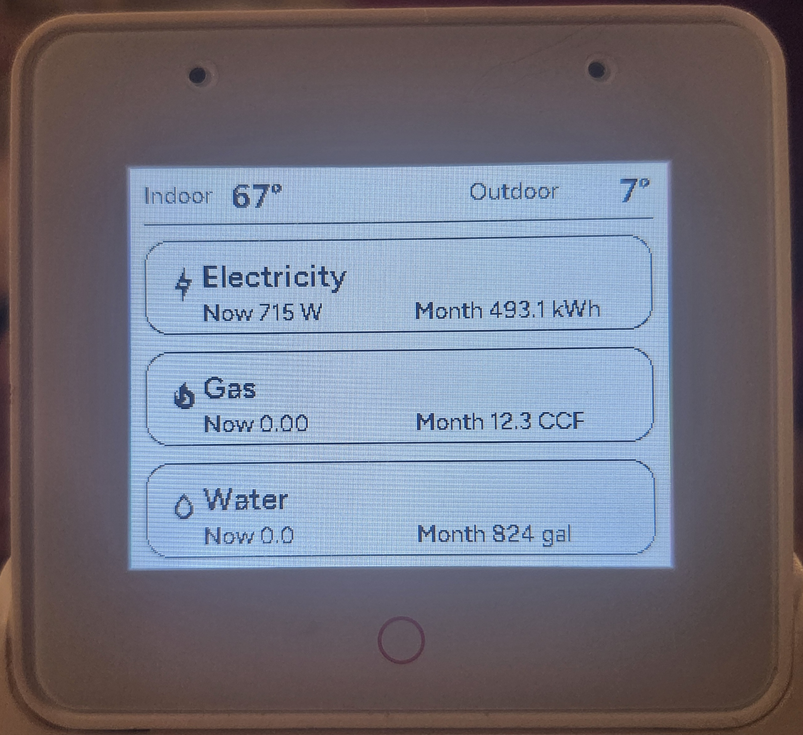
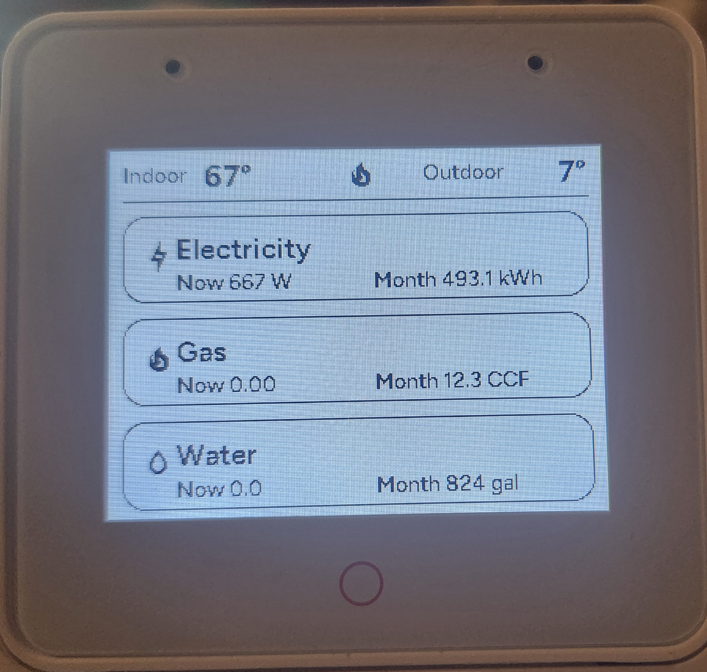

# ESP32-S3 Utilities Display

A clean, high-contrast **utilities dashboard** for the **ESP32-S3-Box-3**, built with ESPHome and optimized for always-on visibility.

---

## 📺 Screen Examples

<table>
  <tr>
    <td align="center">
       
      <em>Without HVAC action</em>
    </td>
    <td align="center">
       
      <em>With HVAC action</em>
    </td>
  </tr>
</table>

---

## Overview

The display shows real-time household utility information in a **black-and-white, e‑ink–style layout** designed to be readable at a distance.

### Top Row
- **Indoor temperature** (left)
- **Outdoor temperature** (right)
- **HVAC state icon** (center)
  - 🔥 Heating
  - ❄ Cooling
  - Blank when idle

### Main Area
- **Electricity** – current usage and monthly total
- **Gas** – current usage and monthly total
- **Water** – current usage and monthly total

---

## Hardware
- ESP32-S3-Box-3
- Built-in ILI9XXX display

## Software
- ESPHome 2025.x+
- Arduino framework
- Home Assistant (sensor source)

---

## Fonts & Icons

- **Text:** Google Fonts – Figtree  
- **Icons:** Material Design Icons (MDI Webfont)

| Purpose | Icon | Codepoint |
|------|------|----------|
| Electricity | Flash | F140C |
| Gas / Heating | Flame | F0238 |
| Water | Water Drop | F0E0A |
| Cooling | Snowflake | F0717 |

---

## Design Goals
- Pure black & white (no color reliance)
- High contrast for low-light rooms
- Pixel-precise spacing
- No voice or touch interaction
- Stable, appliance-like display

---

## Status
**Stable – v0.2.11**
