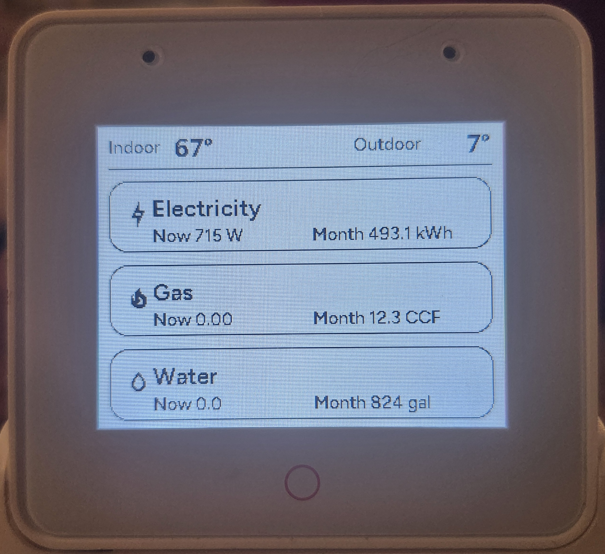
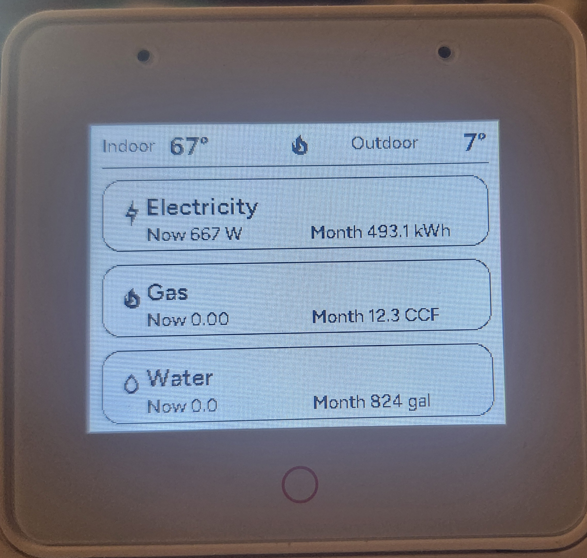

# ESP32-S3 Utilities Display

A clean, high-contrast **utilities dashboard** for the **ESP32-S3-Box-3**, built with ESPHome and optimized for always-on visibility.

---

## 📺 Screen Examples

<table>
  <tr>
    <td align="center">
       
      <em>Without HVAC action</em>
    </td>
    <td align="center">
       
      <em>With HVAC action</em>
    </td>
  </tr>
</table>

---

## 🚧 Project Status

This is an **ongoing project**, and **suggestions, feedback, and ideas are always welcome**.

- **Electricity data** is fully live and based on real sensors  
- **Water data** is now live with daily, weekly, and monthly tracking  
- **Gas data** is currently **placeholder / dummy values** while hardware and integration are finalized  
- Layout, fonts, and spacing are considered **stable**, with continued feature expansion planned  

---

## Overview

The display shows real-time household utility information in a **black-and-white, e-ink–style layout** designed to be readable at a distance.

### Top Row
- **Indoor temperature** (left)  
- **Outdoor temperature** (right)  
- **HVAC state icon** (center)  
  - 🔥 Heating  
  - ❄ Cooling  
  - Blank when idle  

### Main Area
- **Electricity** – current usage and monthly total *(live)*  
- **Gas** – current usage and monthly total *(in progress)*  
- **Water** – daily, weekly, and monthly usage *(live)*  

---

## Hardware
- ESP32-S3-Box-3  
- Built-in ILI9XXX display  

## Software
- ESPHome 2025.x+  
- Arduino framework  
- Home Assistant (sensor source)  

---

## Fonts & Icons

- **Text:** Google Fonts – Figtree  
- **Icons:** Material Design Icons (MDI Webfont)  

| Purpose | Icon | Codepoint |
|--------|------|----------|
| Electricity | Flash | F140C |
| Gas / Heating | Flame | F0238 |
| Water | Water Drop | F0E0A |
| Cooling | Snowflake | F0717 |

---

## 🔮 Future Features

Planned and potential enhancements for upcoming versions:

- Tap a utility card to open a **detailed usage screen**
- On-device **graphing (daily / weekly trends)**
- Optional **popup view** for quick stats
- Gas sensor integration (replace placeholder data)
- Alert indicators (high usage, leak detection, etc.)
- Screen dimming / adaptive brightness improvements
- Optional minimal touch controls (refresh, toggle views)

> Feature development is intentional and staged to maintain a clean, appliance-like experience without clutter.

---

## Design Goals
- Pure black & white (no color reliance)  
- High contrast for low-light rooms  
- Pixel-precise spacing  
- No voice interaction  
- Future-ready for touch interaction  
- Stable, appliance-like display  

---

## Status
**Stable layout – v0.2.13**  
**Features: evolving**
