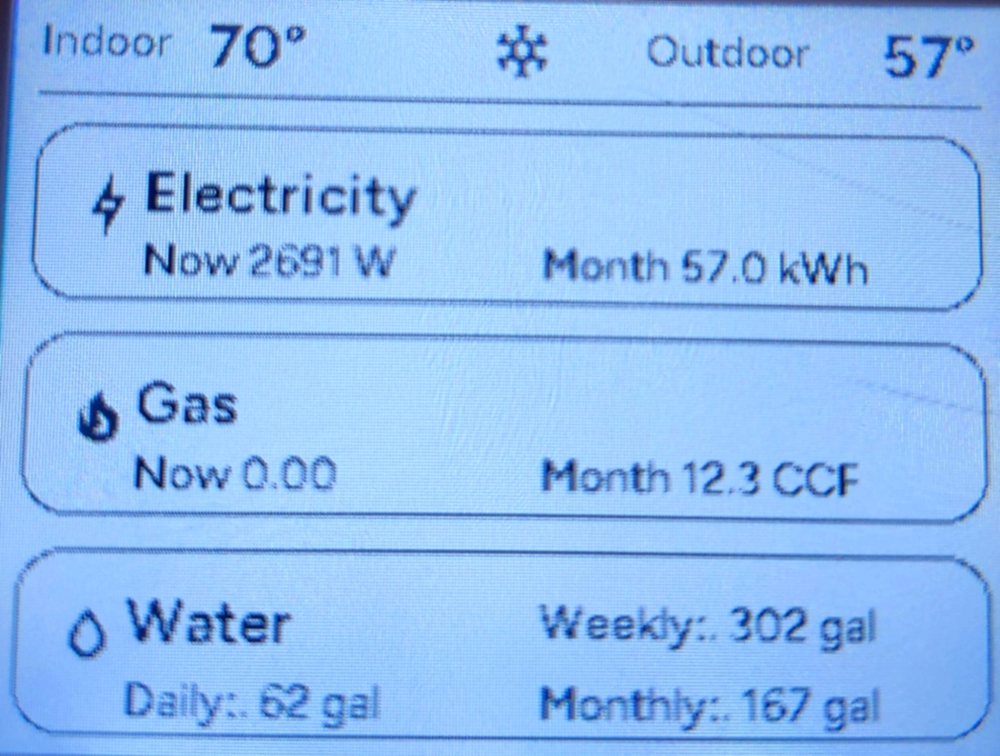
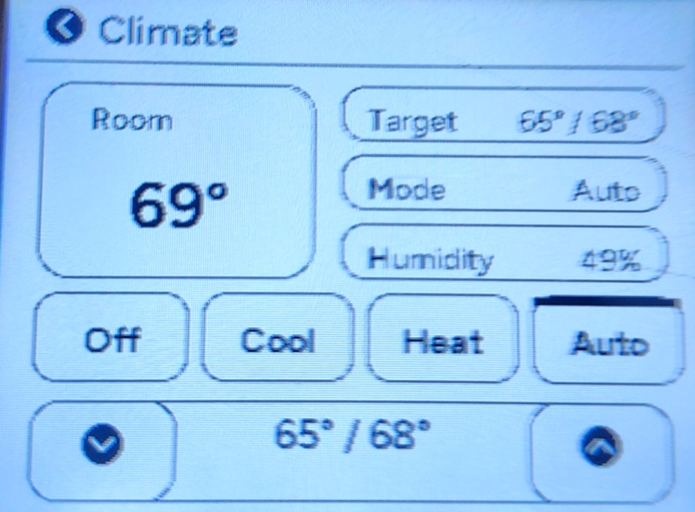
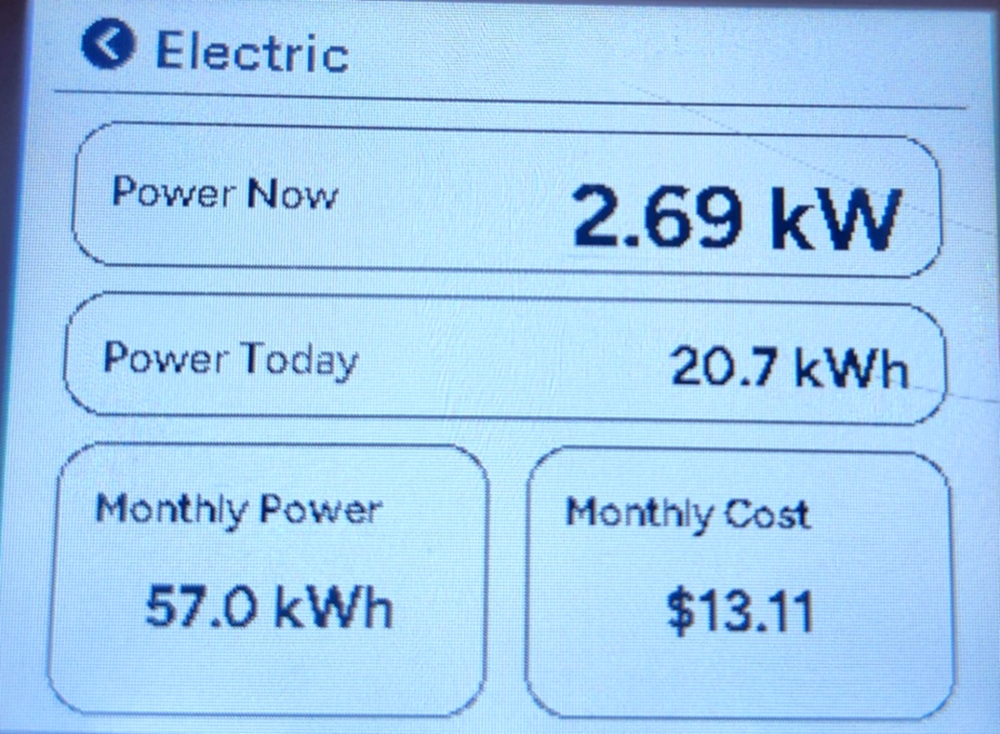
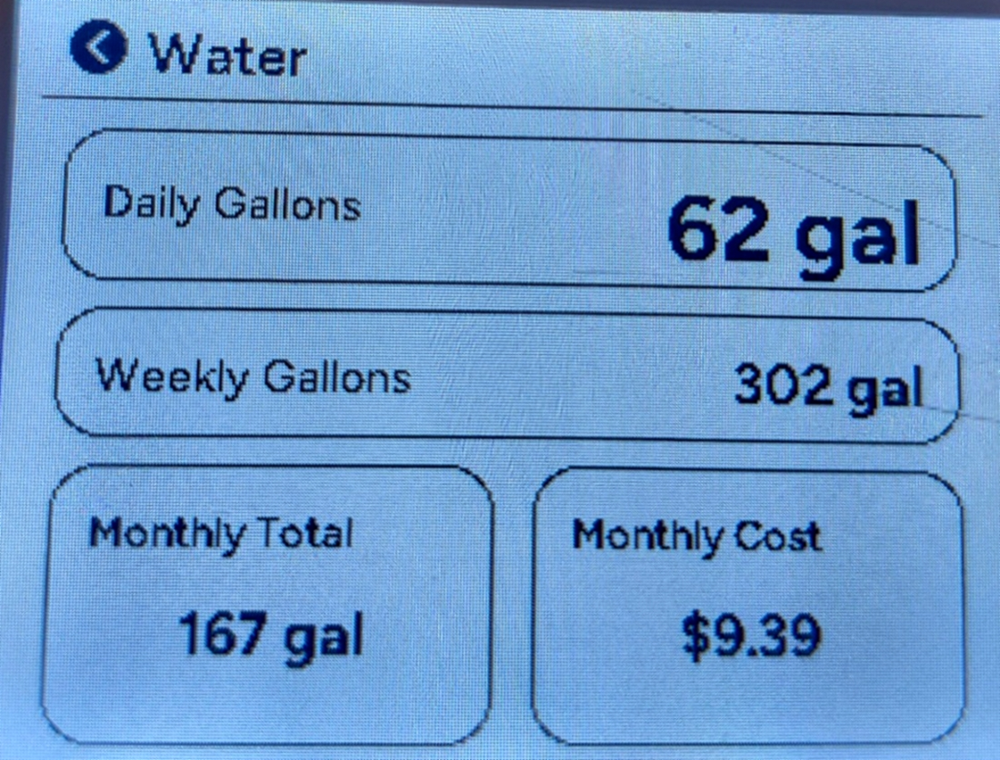
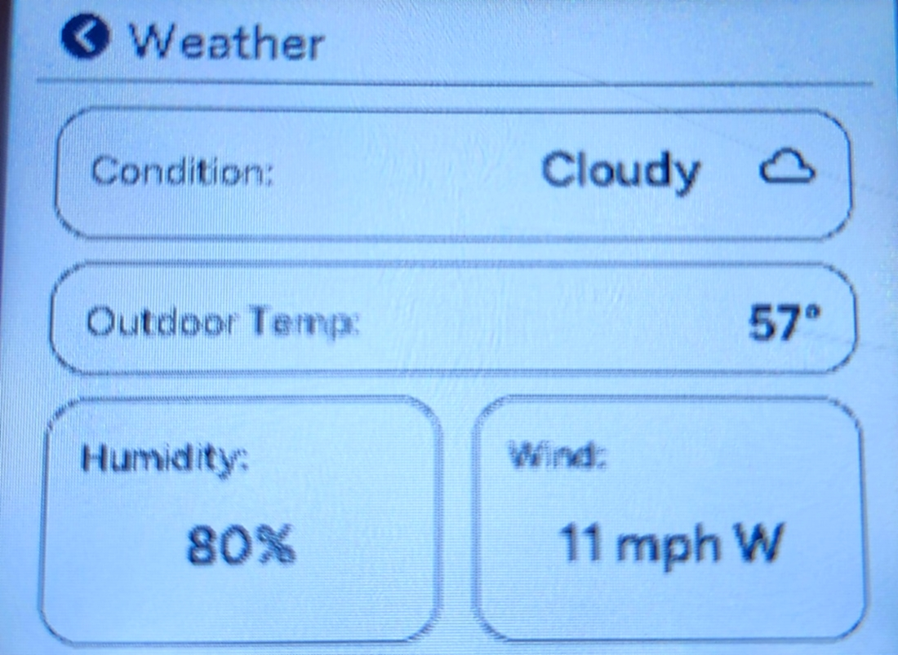

# ESP32-S3 Utilities Display

A clean, high-contrast **utilities dashboard** for the **ESP32-S3-Box-3**, built with ESPHome and optimized for always-on visibility.

---

## 📺 Screen Examples

<table>
  <tr>
    <td align="center">
       
      <em>Home Screen</em>
    </td>
    <td align="center">
       
      <em>Climate Screen</em>
    </td>
        <td align="center">
       
      <em>Electric Screen</em>
    </td>
    <td align="center">
       
      <em>Water Screen</em>
    </td>
        <td align="center">
       
      <em>Weather Screen</em>
    </td>
  </tr>
</table>
I apologise for the quality of the images. I do not have a better camera other than my cell phone. 

---

## Project Status

**Stable release: v0.3.0**

- **Touch navigation** is now implemented across the home screen and detail pages
- **Electricity data** is live and includes a dedicated detail page
- **Water data** is live and includes a dedicated detail page
- **Weather page** is now available from the outdoor temperature area
- **Gas data** remains placeholder / dummy values while hardware and integration are finalized

---

## Overview

The display now provides a touch-enabled, appliance-like interface in a **black-and-white, e-ink–style layout** designed to be readable at a distance.

### Home Screen
- **Indoor temperature** (left)
- **Outdoor temperature** (right, opens Weather page)
- **HVAC state icon** (center)
  - Heating
  - Cooling
  - Blank when idle
- **Electricity card** (opens Electric page)
- **Gas card** (placeholder)
- **Water card** (opens Water page)

### Detail Pages
- **Electric page**
  - Power now
  - Power today
  - Monthly power
  - Monthly cost

- **Water page**
  - Daily gallons
  - Weekly gallons
  - Monthly total
  - Monthly cost

- **Weather page**
  - Condition with icon
  - Outdoor temperature
  - Outdoor humidity
  - Wind conditions

- **Climate page**
  - Touch controls for HVAC mode and temperature
  - Visual feedback for button presses

---

## Hardware
- ESP32-S3-Box-3
- Built-in ILI9XXX display
- Built-in GT911 touchscreen

## Software
- ESPHome 2025.x+
- ESP-IDF framework
- Home Assistant (sensor source)

---

## Fonts & Icons

- **Text:** Google Fonts – Figtree
- **Icons:** Material Design Icons (MDI Webfont)

| Purpose | Icon | Codepoint |
|--------|------|----------|
| Electricity | Flash | F140C |
| Gas / Heating | Flame | F0238 |
| Water | Water Drop | F0E0A |
| Cooling | Snowflake | F0717 |
| Navigation | Back / Arrows | Various MDI glyphs |
| Weather | Condition icons | Various MDI glyphs |

---

## Current Features

- Touch-enabled home screen navigation
- Electric detail page
- Water detail page
- Weather detail page
- Climate touch controls
- Auto-return to home after idle timeout
- Unified page layout and spacing
- Black-and-white appliance-style design

---

## Future Features

Planned and potential enhancements for upcoming versions:

- Gas sensor integration (replace placeholder data)
- Additional weather refinement if needed
- Adaptive brightness improvements
- Additional usage screens or trends where useful
- Optional alert indicators for abnormal usage

---

## Design Goals
- Pure black & white (no color reliance)
- High contrast for low-light rooms
- Pixel-precise spacing
- No voice interaction
- Touch-first navigation
- Stable, appliance-like display

---

## Status
**Stable release – v0.3.0**
**Touch UI + Electric + Water + Weather**
